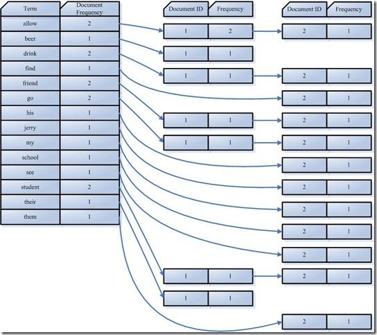

* 全文索引
```
结构化数据： 指具有固定格式或有限长度的数据，如数据库，元数据等
非结构化数据(全文数据)： 指不定长或无固定格式的数据，如邮件，word文档等
```
  - 顺序扫描法 (Serial Scanning)
  - 全文检索(Full-text Search)
    - 索引创建 (Indexing)
    - 搜索索引 (Search)

* 索引创建(Indexing)
  - 第一步：一些要索引的原文档(Document)
  - 第二步：将原文档传给分次组件(Tokenizer)
    1. 将文档分成一个一个单独的单词
    - 去除标点符号
    - 去除停词(Stop word)
    - 经过分词(Tokenizer) 后得到的结果称为词元(Token)
  - 第三步：将得到的词元(Token)传给语言处理组件(Linguistic Processor)。
    1. 变为小写(Lowercase)
    - 将单词缩减为词根形式，如“cars ”到“car ”等。这种操作称为：stemming
    - 将单词转变为词根形式，如“drove ”到“drive ”等。这种操作称为：lemmatization
    - 语言处理组件(linguistic processor)的结果称为词(Term) 。
  - 第四步：将得到的词(Term)传给索引组件(Indexer)
    1. 利用得到的词(Term)创建一个字典
    2. 对字典按字母顺序进行排序
    3. 合并相同的词(Term) 成为文档倒排(Posting List) 链表:如图
     
      - Document Frequency 即文档频次，表示总共有多少文件包含此词(Term)。
      - Term Frequency 即词频率，表示此文件中包含了几个此词(Term)。

* 搜索索引(Search)
  - 第一步：用户输入查询语句
  - 第二步：对查询语句进行词法分析，语法分析，及语言处理
    1. 词法分析主要用来识别单词和关键字
    2. 语法分析主要是根据查询语句的语法规则来形成一棵语法树
    3. 语言处理同索引过程中的语言处理几乎相同
  - 第三步：搜索索引，得到符合语法树的文档
  - 第四步：根据得到的文档和查询语句的相关性，对结果进行排序
    - 找出词(Term) 对文档的重要性的过程称为计算词的权重(Term weight) 的过程
    - 判断词(Term) 之间的关系从而得到文档相关性的过程应用一种叫做向量空间模型的算法(Vector Space Model)
